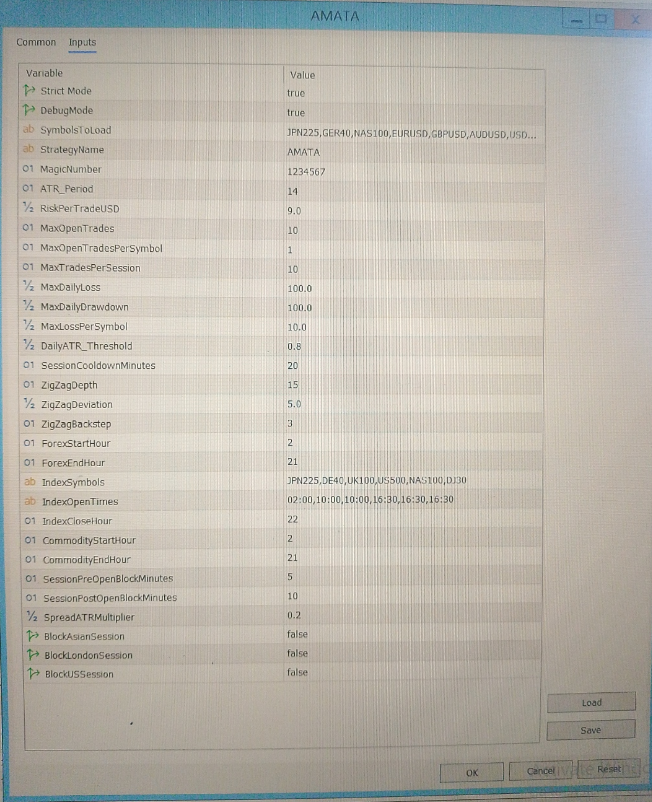

# AMATA Platform Configurations

AMATA exposes a set of high‑level configuration parameters that define the *environment* in which strategies operate.  
These inputs do **not** modify strategy logic — they control safety, volatility handling, structure detection and institutional activity windows.

---

## 1. Safety & Execution Controls
Defines when AMATA is allowed to execute and how risk is enforced at the platform level.

### **- MaxDailyLoss**
Stops all trading for the day once realized losses exceed this threshold.

### **- MaxDailyDrawdown**
Pauses execution if the account experiences a peak‑to‑trough drawdown beyond the configured limit.

### **- MaxLossPerSymbol**
Prevents overexposure by limiting the maximum allowed loss per individual symbol.

### **- MaxOpenTrades**
Global cap on the number of simultaneous open positions across all symbols.

### **- MaxOpenTradesPerSymbol**
Restricts how many trades a single symbol may hold at the same time.

### **- MaxTradesPerSession**
Prevents over‑trading within a single liquidity session.

### **- BlockAsianSession / BlockLondonSession / BlockUSSession**
Disables trading for the entire session.

Used on days with dense news clusters or extreme macro events (e.g., CPI, NFP, rate decisions) when volatility is unpredictable and institutional desks often stay flat.
This allows the user to avoid execution between back‑to‑back releases or during sessions known to produce unstable market conditions.

### **- SessionPreOpenBlockMinutes**
Blocks trading X minutes before a session opens.

Applies only to sessions that are enabled via BlockAsianSession, BlockLondonSession or BlockUSSession.

### **- SessionPostOpenBlockMinutes**
Extends the block after session open to avoid spread spikes and chaotic opening behavior.

Also applies only to sessions that are actively blocked.

## 1.1 Strict Mode (Platform Integrity Protection)

### **- StrictMode**
Prevents users from manually modifying or interfering with trades that AMATA has opened and is managing.

When **StrictMode = true**, AMATA enforces full platform integrity by blocking:

- manual closing of AMATA‑managed positions  
- manual modification of SL/TP  
- manual volume adjustments  
- manual movement or deletion of pending orders  
- any discretionary intervention that would break AMATA’s internal logic  

This ensures that AMATA can operate with full autonomy and execute its strategy without disruption.  
Strict Mode is recommended for all production environments where AMATA’s statistical edge and execution logic must remain intact.

Strict Mode exists to guarantee that AMATA’s execution logic, statistical edge and risk framework remain intact — without the risk of accidental or emotional manual interference.
If the user disables Strict Mode, they regain full manual control — but also assume responsibility for any deviations from AMATA’s intended behavior.

---

## 2. Volatility & Exhaustion Controls

These parameters define how AMATA interprets market volatility and when a symbol should be considered temporarily unsafe to trade.  
They influence volatility classification, exhaustion detection, and spread‑to‑volatility validation.

### User‑Configurable Inputs

- **ATR_Period**  
  Defines the ATR window used for volatility measurement.

- **DailyATR_Threshold**  
  If a symbol’s adjusted daily range exceeds this ATR‑based threshold, AMATA stops scanning it for the remainder of the day.  
  This protects against abnormal, event‑driven volatility specific to that instrument.

- **SpreadATRMultiplier**  
  Prevents execution when the spread is too large relative to the symbol’s current ATR.  
  Ensures that trades are only taken when volatility justifies the spread cost.

### Platform‑Controlled Volatility Logic

AMATA includes additional volatility‑driven safety mechanisms that are not user‑configurable.  
These are implemented by the **Volatility Engine** and include:

- adjusted daily range calculation  
- daily exhaustion detection  
- volatility bucket classification  
- spread‑to‑ATR validation  
- per‑symbol session cooldown windows  

These mechanisms ensure stable execution conditions and protect the platform from trading during abnormal volatility spikes or illiquid market phases.  
They operate automatically and do not modify strategy logic — they define the *environment* in which strategies are allowed to operate.

---

## 3. Structure‑Based SL/TSL Configuration
AMATA uses a ZigZag‑based structure model to identify recent swing highs and lows for stop‑loss placement and trailing logic.

The parameters below control how sensitive the structure detection is, but the underlying logic follows the standard MetaTrader ZigZag implementation.

### **- ZigZagDepth / ZigZagDeviation / ZigZagBackstep**
These parameters define how AMATA interprets structural swings.

For detailed behavior, refer to the official MetaTrader ZigZag documentation.

---

## 4. Institutional Activity Windows
Defines when AMATA is active for each asset class, aligned with institutional liquidity.

### **- ForexStartHour / ForexEndHour**
Primary trading window for FX pairs.

### **- CommodityStartHour / CommodityEndHour**
Defines when commodity markets are considered liquid and tradable.

### **- IndexOpenTimes**
List of index‑specific open times used for session‑based logic.

### **- IndexCloseHour**
Defines when index trading should stop for the day.

Different symbols open at different times, and AMATA aligns activity windows accordingly.

### **- DailySessionClose (Automatic Position Flush)**
AMATA automatically closes all open positions at the end of each trading day.

This avoids overnight swaps, illiquid Asian‑session conditions, and extreme spread expansion.
The platform resets and reloads symbol states every night to ensure clean execution conditions for the next day.

---

## 5. Symbol Loading & Mapping
Controls which symbols AMATA manages and how they are grouped.

### **- SymbolsToLoad**
List of all symbols AMATA should initialize, monitor and manage.

### **- IndexSymbols**
Defines which symbols belong to the index asset class for session and volatility logic.

---

## 6. Debug & Development Tools
Enables additional console output for development and troubleshooting.

### **- DebugMode**
Activates extended logging for diagnostics, development and platform verification.

---

