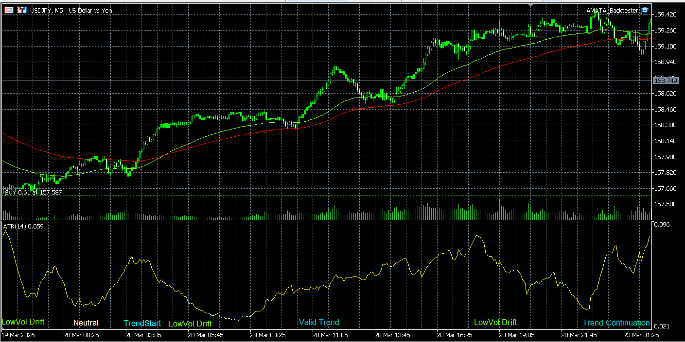
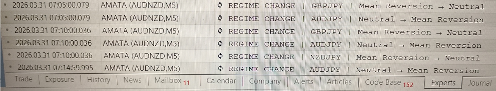

# Regime Detection Function  
*How AMATA Reads and Classifies Market Structure*

AMATA continuously evaluates the market environment for every active symbol.  
This process is handled by the **Regime Detection Function**, a core component responsible for transforming raw price behaviour into a structured, machine‑readable market state.

Regime detection is **fully mechanical**, **symbol‑specific**, and **executed on every tick**.

---

## Purpose of Regime Detection

The function determines the current **market regime**, which represents the structural condition of the symbol.  
This classification is used by all Strategy Modules to decide:

- whether a strategy is allowed  
- whether edge exists  
- whether risk is permitted  
- whether execution should be blocked  
- which strategy (if any) should activate  

Regime detection is the foundation for AMATA’s **multi‑strategy capability**.

---

## Regime Detection Capabilities

The AMATA Platform is capable of detecting the following **market structure regimes**:

- **Neutral**  
- **TrendStart**  
- **Trend**  
- **LowVol Drift**  
- **Choppy**  
- **Volatility Expansion**  
- **Exhaustion / Overextended**  
- **Mean Reversion**  

These represent **raw market conditions** classified by the Regime Engine.

The Regime Engine itself is **fully extensible**, allowing additional regimes to be introduced if a user or strategy family requires more granular market states (e.g., Pullback, Liquidity Sweep, Compression, Pre‑Breakout, etc.).

Each symbol profile may choose to use only a subset of these regimes, or interpret them through its own **entry‑policy states** (e.g., “Valid Strong”, “Premature Entry”, “Weak TrendStart”, etc.), which are **fully adaptable to the user’s strategy design and risk preferences.**

---

## Visual Example: Regime Detection in Practice

Below is a real backtesting example showing how AMATA transitions between volatility regimes on USDJPY.

**Illustration of USDJPY moving from a neutral volatility regime into a TrendStart impulse, followed by a confirmed trend phase and later trend continuation during AMATA backtesting.**

This example is purely a visualisation of how AMATA interprets structural behaviour — not a performance chart, but a conceptual demonstration of regime transitions.

---

## Symbol‑Specific Thresholds

Regime classification is driven by **Symbol Profiles**, which define:

- ATR thresholds  
- volatility bands  
- trend strength parameters  
- structural filters  
- allowed regimes  
- regime‑specific constraints  

Because each symbol behaves differently, AMATA maintains **independent regime logic per symbol**.
This ensures that every asset is classified according to its own volatility structure and behavioural characteristics.

Example:  
Gold (XAUUSD) may have different TrendStart thresholds than USDJPY or AUS200.

---

## Real‑Time Classification Pipeline

For every tick, AMATA executes the following steps:

1. **Read symbol profile**  
2. **Evaluate volatility state**  
3. **Evaluate structural behaviour**  
4. **Check trend conditions**  
5. **Check drift / choppy filters**  
6. **Determine regime**  
7. **Log regime changes**  
8. **Expose regime to Strategy Modules**

This pipeline runs independently for each symbol, enabling true multi‑asset classification and multi‑strategy execution.

---

## Regime Change Logging

Every regime transition is logged in real time.

Example:

REGIME INIT     | XAUUSD | Neutral
REGIME CHANGE   | XAUUSD | Neutral → Mean Reversion
REGIME CHANGE   | US30   | Mean Reversion → Overextended
REGIME CHANGE   | US30   | Overextended → Neutral

These logs are used for:

- debugging  
- backtesting validation  
- strategy development  
- visual regime mapping  
- multi‑strategy coordination  
- **user transparency (understanding how AMATA scans the market continuously)**  

Regime logs do **not** influence execution.  
They exist purely to verify that AMATA’s market classification behaves as expected across all active symbols.

---

## Visual Example: Live Regime Logging

Below is a real example in the MT5 platform from AMATA’s live regime detection, showing how multiple symbols transition between regimes in real time.

AMATA logs every regime transition mechanically, across all active symbols, 24/7.  
This transparency allows users to verify that the Regime Engine behaves as expected during live trading.

---

## Why Regime Detection Matters

Regime detection enables AMATA to:

- avoid trading in low‑edge environments  
- activate the correct strategy at the correct time  
- run multiple strategies per symbol  
- maintain clean separation between modules  
- scale across assets and timeframes  
- support institutional‑style diversification  

Without regime detection, AMATA would behave like a traditional EA.  
With it, AMATA becomes a **context‑aware trading platform**.

---

## Summary

The Regime Detection Function is the core mechanism that allows AMATA to:

- understand market structure  
- classify environments mechanically  
- coordinate multiple strategies  
- maintain symbol‑specific intelligence  
- operate as a unified, scalable trading platform

It is the bridge between **raw price data** and **modular strategy execution**.
