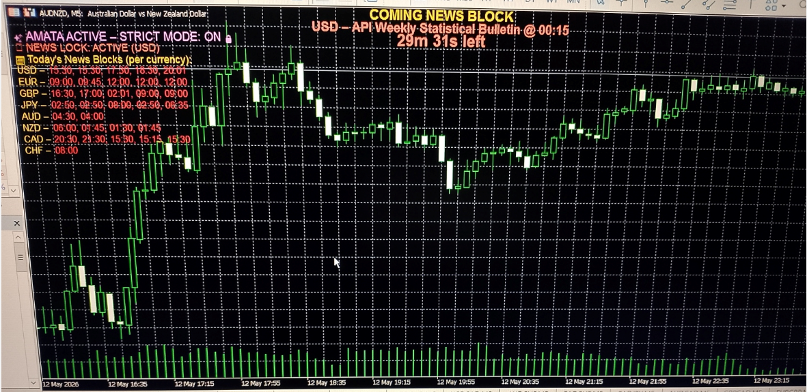

# AMATA Dashboard  
**Real‑Time Transparency for News‑Aware Execution**

The AMATA Dashboard provides a clear, real‑time visualization of upcoming daily news events and Safety Engine lock states across the entire platform. All of this runs from a single chart. 
It is designed to give users full transparency into AMATA’s operational status without requiring interaction with logs or configuration files.

---

## 1. Purpose

The dashboard serves as AMATA’s real‑time information layer.  
It visualizes how AMATA reads and interprets the external news files and how these files are converted into structured news blocks — fully automatically and without any user involvement.

It allows users to instantly see:

- Which news events AMATA has parsed from the external files for the current day
- How these events are mapped into currency‑specific block lists
- Whether AMATA has activated a system‑wide lock for a specific currency (blocking all symbols containing that currency)
- When normal trading will automatically resume

The purpose is **transparency**:
to show what AMATA already knows and is already enforcing — not something the user needs to manage manually.

---

## 2. Status Panel & Daily News Blocks Overview

The Dashboard is structured into three stacked layers, each reflecting a different part of AMATA’s real‑time state.

### a) System Status Line (Top‑Left)

This line shows AMATA’s global operating mode:

- **AMATA ACTIVE – STRICT MODE: ON 🔒**  
- **AMATA ACTIVE – STRICT MODE: OFF 🟢**  
- **AMATA INACTIVE**

This gives an immediate understanding of whether the system is allowed to execute trades.

Strict Mode is a platform‑level protection feature that prevents manual interference with AMATA‑managed trades. For a full explanation, see the **Strict Mode section** in the [Platform Configurations Section 1.1](./A3_Platform_Configurations.md) documentation.

---

### b) Global News Lock Indicator

Directly under the system status, AMATA displays the current news lock state:

- **🟥 NEWS LOCK: ACTIVE (CURRENCY)**  
- **🟩 NEWS LOCK: NONE**

A global lock means **all symbols containing that currency are restricted**, regardless of which chart AMATA is attached to.

This is the Safety Engine’s real‑time output.

---

### c) Daily News Blocks (Currency‑Sorted List)

Below the lock indicator, the Dashboard prints a full list of today’s news events, grouped by currency and sorted by time.

Each currency appears as:

CURRENCY – HH:MM, HH:MM, HH:MM

The left label shows the currency prefix (e.g., “USD –”),  
and the right label shows all event times for that currency.

This list is dynamically generated from AMATA’s external news files and reflects the architect‑defined set of high‑impact releases selected for each currency.
**Only currencies with architect‑approved, volatility‑relevant releases for the current day are shown**.

The formatting is intentionally compact and aligned to remain readable even on smaller screens.

---

## 3. Coming News Block & Countdown (Centered at the Top)

Independently of the left‑aligned panel, AMATA renders a **centered, high‑visibility block** showing either the currently active news block or the next upcoming one.

### Active Block

Displayed when a news lock is currently active:

- “COMING NEWS BLOCK”  
- `<CURRENCY> – <TITLE> @ <TIME>`  
- Countdown until the lock expires  
- Blinking when < 60 seconds remain  

### Next Upcoming Block

Displayed when no lock is active:

- “COMING NEWS BLOCK”  
- `<CURRENCY> – <TITLE> @ <TIME>`  
- Countdown until the event begins  
- Blinking when < 60 seconds remain  

This section uses larger fonts and centered alignment to ensure visibility during live trading.

---

## 4. Global Scope From a Single Chart

AMATA is **global** and only needs to run on a single chart.  
From that chart, the Dashboard visualizes all news‑driven lock states across every symbol managed by AMATA.

This ensures:

- a single point of control
- no need to attach AMATA to multiple charts
- full alignment with the Safety Engine’s global behavior
- consistent execution across the entire portfolio

---

## 5. Integration With the Safety Engine

The dashboard is tightly integrated with the Safety Engine:

- Countdown begins before a news event  
- Lock activates and updates instantly  
- Lock expires and the dashboard returns to normal  
- All logic is driven by external news files  

For a complete explanation of how AMATA evaluates, filters, and applies news‑based execution locks, see the [**Safety Engine documentation**](./E1_Safety_Engine.md).

The dashboard visualizes state — it does not influence trading logic.

---

# Summary

The AMATA Dashboard provides a clean, real‑time visualization of upcoming news events and lock states.  
It complements the Safety Engine by offering full transparency, global news awareness, and intuitive countdowns — all from a single chart.
Together, they deliver an institutional‑grade user experience with complete clarity and zero operational friction.

---
