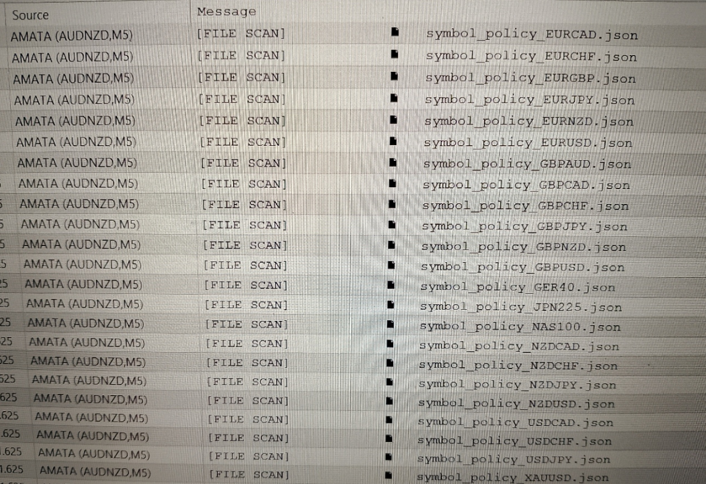
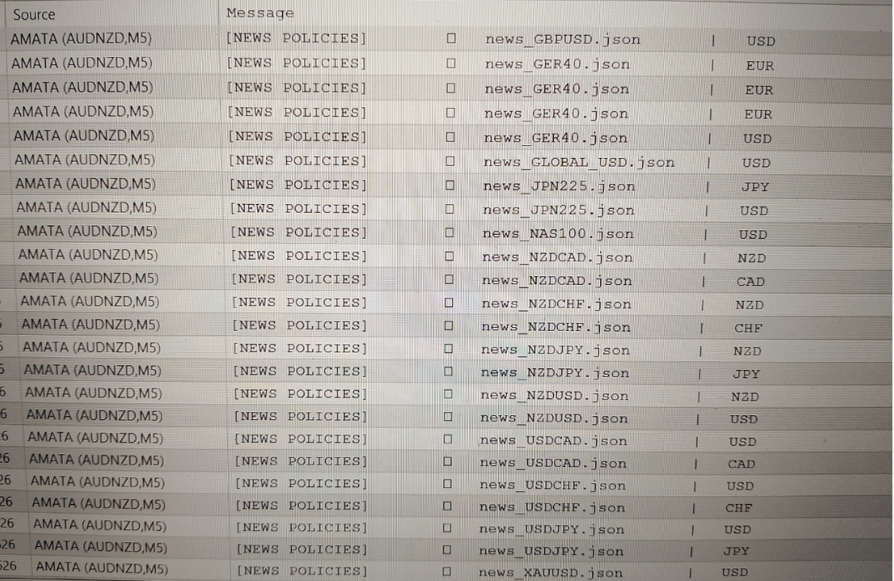
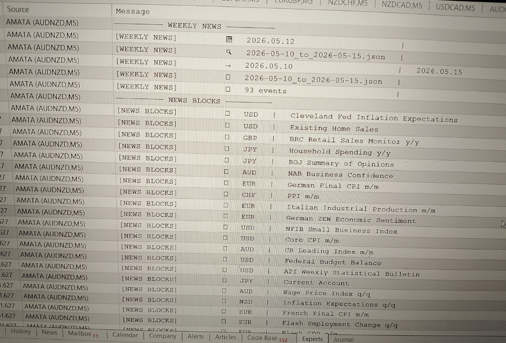
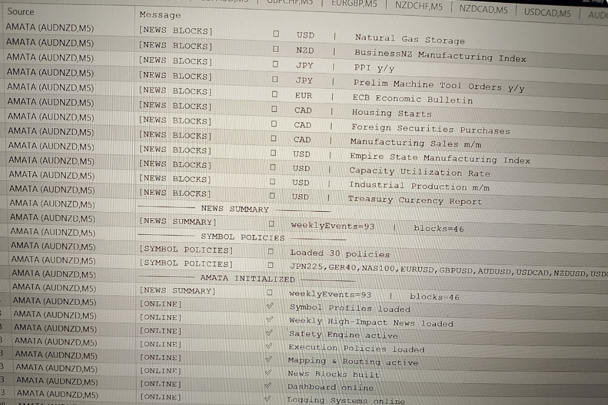

# AMATA Initialization Sequence  

This example demonstrates how the AMATA platform initializes when attached to a chart.  
The sequence illustrates how each subsystem loads, validates, and activates before any trading logic is allowed to run.

---

## 🎥 Video Demonstration  

📺 **AMATA Platform Initialization – Desktop (16:9)**  
https://youtu.be/xdFQfwbHBqU

📱 **AMATA Platform Initialization – Mobile (9:16)**  
https://youtube.com/shorts/2P1ZYf3fZFU

This video shows the full initialization sequence in real time, including file scanning, news parsing, block generation, and subsystem activation.

---

## 1. File Scan  

AMATA begins by scanning the filesystem for all required configuration files:

- Symbol Profile files  
- News Policy files  
- Weekly Macro News file  
- Execution Policy files  
- Safety Engine configuration  

This step ensures that all external modules are present and valid before the platform proceeds.

**Example Output:**  

---

## 2. News Policies  

Next, AMATA loads symbol‑specific news policies.  
These define:

- which news titles affect which symbols  
- which currencies each symbol is sensitive to  
- which events should trigger blocks  
- how news routing and mapping is performed  

This step activates AMATA’s symbol‑aware news filtering system.

**Example Output:**  

---

## 3. Weekly News & News Blocks  

AMATA then parses the Weekly Macro News file.  
In this example:

- **93 high‑impact events** were detected  
- each event is listed with title and currency  
- AMATA automatically generates **news blocks** for all events that match symbol‑specific policies  

This forms the foundation of AMATA’s macro‑aware safety layer.

**Example Output:**  

---

## 4. Initialization Summary  

Finally, AMATA summarizes the entire initialization sequence.  
In this example:

- **93 weekly events** detected  
- **46 events** will trigger trading blocks  
- **30 symbol profiles** successfully loaded (with multiple strategies per profile)

All engines and subsystems are online:

  - Symbol Profiles  
  - Weekly High‑Impact News  
  - Safety Engine  
  - Execution Policies  
  - Mapping & Routing  
  - News Blocks  
  - Dashboard  
  - Logging Systems  

**Example Output:**  

---
